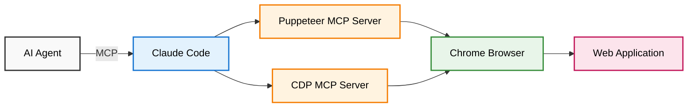

# 🔮 BabaYaga

> Powerful browser automation tools for Claude Code - available to your entire team or just for you

[](https://nodejs.org)
[](LICENSE)
[](https://github.com/modelcontextprotocol)
[](https://www.typescriptlang.org/)

## What is BabaYaga?

BabaYaga provides AI agents with browser automation superpowers through the Model Context Protocol (MCP). It combines Puppeteer for high-level automation with Chrome DevTools Protocol for deep inspection - perfect for testing, web scraping, and automated QA.

### ✨ Key Features

- 🤝 **Team-friendly** - Share browser automation tools with your entire team via `.mcp.json`
- 👤 **Personal use** - Install globally for use across all your projects
- 🤖 **Dual MCP servers** - Puppeteer for automation, CDP for inspection
- 🌐 **Cross-platform** - Works on macOS, Windows, and Linux
- 🔧 **13 powerful tools** - Screenshots, console logs, element inspection, and more
- 📦 **Easy setup** - Interactive installer for both team and individual use

## Installation

### 🚀 Quick Setup

```bash
# Clone BabaYaga
git clone https://github.com/yourusername/babayaga.git
cd babayaga

# Install dependencies
npm install

# Run interactive setup
npm run setup
```

The setup wizard will help you choose between:
1. **Team Setup** - Adds BabaYaga to your project for team sharing
2. **Individual Setup** - Installs globally for personal use
3. **Both** - Configure for team AND personal use

### 👥 Team Setup (Recommended for Projects)

Add BabaYaga to your project so your entire team has access:

```bash
# In your project directory
git submodule add https://github.com/yourusername/babayaga.git
cd babayaga && npm install && cd ..

# Run setup to generate .mcp.json
npx babayaga/scripts/setup.js
```

This creates `.mcp.json` in your project:
```json
{
  "mcpServers": {
    "puppeteer-babayaga": {
      "command": "npm",
      "args": ["run", "start:puppeteer-mcp"],
      "cwd": "./babayaga"
    },
    "cdp-babayaga": {
      "command": "npm",
      "args": ["run", "start:cdp-mcp"],
      "cwd": "./babayaga"
    }
  }
}
```

**Team members** just need to:
1. Clone your repository (including the submodule)
2. Approve the MCP servers when Claude Code prompts them
3. Start using BabaYaga tools immediately!

### 👤 Individual Setup (For Personal Use)

Install BabaYaga globally for use across all your projects:

```bash
# Clone to your preferred location
mkdir -p ~/tools
cd ~/tools
git clone https://github.com/yourusername/babayaga.git
cd babayaga
npm install

# Add to your user configuration
claude mcp add puppeteer-babayaga -s user \
  "npm" "run" "start:puppeteer-mcp" \
  --cwd "$PWD"

claude mcp add cdp-babayaga -s user \
  "npm" "run" "start:cdp-mcp" \
  --cwd "$PWD"
```

## Usage

### Start Chrome with Debugging

Before using BabaYaga tools, start Chrome:

```bash
# From your project (team setup)
cd babayaga && npm run chrome

# From global installation (individual setup)
cd ~/tools/babayaga && npm run chrome
```

### Available Tools

#### 🎭 Puppeteer Tools
| Tool | Description |
|------|-------------|
| `puppeteer_connect_active_tab` | Connect to existing Chrome instance |
| `puppeteer_navigate` | Navigate to a URL |
| `puppeteer_screenshot` | Capture screenshots |
| `puppeteer_click` | Click elements |
| `puppeteer_fill` | Fill input fields |
| `puppeteer_select` | Select dropdown options |
| `puppeteer_hover` | Hover over elements |
| `puppeteer_evaluate` | Execute JavaScript |

#### 🔍 CDP Tools
| Tool | Description |
|------|-------------|
| `cdp_connect` | Connect to Chrome DevTools |
| `cdp_list_targets` | List all browser tabs |
| `cdp_evaluate` | Execute JavaScript via CDP |
| `cdp_get_console_messages` | Retrieve console logs |
| `cdp_get_computed_style` | Inspect element styles |

### Example Claude Code Usage

```
# Test your local development server
Using the puppeteer-babayaga tool, navigate to http://localhost:3000
Using the puppeteer-babayaga tool, take a screenshot named "homepage"
Using the cdp-babayaga tool, get console messages

# Click and verify
Using the puppeteer-babayaga tool, click selector button.submit
Using the cdp-babayaga tool, evaluate document.querySelector('.success-message').textContent

# Debug styling issues
Using the cdp-babayaga tool, get computed style for selector .header
```

## Architecture



## Testing

```bash
# Test MCP server connectivity
npm run test:servers

# Run E2E test suite (requires Chrome)
npm run test:e2e

# Type checking
npx tsc --noEmit
```

## Project Structure

```
babayaga/
├── .mcp.json.example      # Example team configuration
├── src/                   # Source code
│   ├── cdp-mcp-server/   # CDP MCP implementation
│   └── start-*.ts        # Server launchers
├── scripts/              # Setup and utility scripts
├── test-app/             # Interactive test application
└── docs/                 # Additional documentation
```

## Documentation

- 📚 [Installation Guide](docs/installation.md) - Detailed setup instructions
- 🤖 [Tools Reference](docs/tools-reference.md) - Complete guide to all MCP tools
- 🧪 [E2E Test Examples](docs/example-e2e-test.md) - Real-world usage scenarios
- 🏗️ [Architecture Overview](docs/architecture-diagram.md) - System design and data flow

## Contributing

We welcome contributions! Please see our [Contributing Guide](CONTRIBUTING.md) for details.

## Use Cases

- **E2E Testing** - AI-driven test generation and execution
- **Visual Regression** - Screenshot comparison and UI validation
- **Debugging** - Console monitoring and element inspection
- **Web Scraping** - Intelligent data extraction with browser automation
- **Accessibility** - Automated ARIA and contrast checking

## Troubleshooting

### Chrome won't start
- Ensure Chrome/Chromium is installed
- Check if port 9222 is already in use
- Try `npm run chrome` from the BabaYaga directory

### MCP servers not found
- For team setup: Ensure `.mcp.json` is in your project root
- For individual setup: Check `claude mcp list -s user`
- Make sure you've run `npm install` in the BabaYaga directory

### Tools not working
- Verify Chrome is running with debugging enabled
- Check that both MCP servers are registered
- Look for errors in Claude Code's output panel

## License

MIT License - see [LICENSE](LICENSE) file for details.

---

<p align="center">
  Made with ❤️ for teams building with AI
</p>