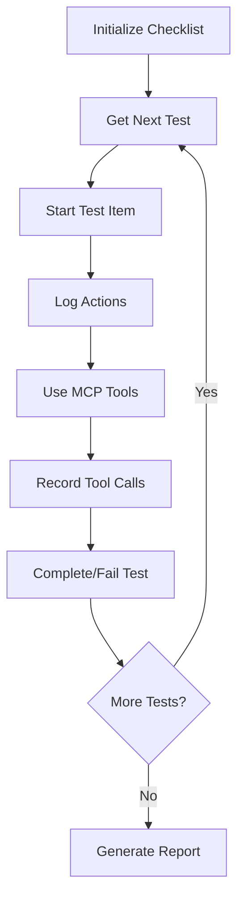

# Checklist-Driven Agent Testing Guide

## Overview

This system ensures agents complete tests one by one, provide verifiable logs, and mark checkboxes as done with evidence. No more faking results - every action is tracked and verified!

## How It Works

### 1. **Checklist Structure**
Each test item includes:
- ✅ Clear instructions for the agent
- ✅ Expected outcomes 
- ✅ Verification criteria
- ✅ Evidence requirements

### 2. **Agent Workflow**


### 3. **Evidence Collection**
Every action is automatically tracked:
- 📝 Action logs with timestamps
- 🔧 Tool calls with parameters, responses, and timing
- 📸 Screenshots before/after actions
- 📊 Measurement data
- ❌ Error messages
- 🌐 Network requests

## MCP Tools for Agents

### Test Management Tools

```typescript
// Initialize testing session
initialize_agent_checklist({
  agentId: "agent-001",
  checklistPath: "tests/checklists/babayaga-basic-tests.json"
})

// Get next test to work on
get_next_test({
  agentId: "agent-001"
})

// Log actions during testing
log_test_action({
  agentId: "agent-001",
  itemId: "test-001",
  action: "Navigating to test page",
  context: { url: "tests/fixtures/html/basic-test.html" }
})

// Record tool usage with timing
record_tool_call({
  agentId: "agent-001",
  itemId: "test-001", 
  toolName: "qa_measure_element",
  parameters: { selector: "#test-element" },
  response: { dimensions: { width: 100, height: 50 } },
  duration: 45,
  success: true
})

// Complete test with results
complete_test_item({
  agentId: "agent-001",
  itemId: "test-001",
  passed: true,
  comments: "Element measurement successful. Verified dimensions match expected values."
})
```

### Status and Reporting Tools

```typescript
// Check progress
get_checklist_status({
  agentId: "agent-001"
})

// Generate final report
get_checklist_report({
  agentId: "agent-001"
})
```

## Example Agent Conversation

```
Agent: I need to run the babayaga-qe test checklist.

MCP: Use initialize_agent_checklist with your agent ID and the checklist path.

Agent: initialize_agent_checklist({
  agentId: "claude-tester-001",
  checklistPath: "tests/checklists/babayaga-basic-tests.json"
})

MCP: ✅ Checklist initialized successfully for agent claude-tester-001. 
Ready to execute 10 tests. Use 'get_next_test' to start testing.

Agent: get_next_test({ agentId: "claude-tester-001" })

MCP: 📋 Next Test: Verify CDP Connection Health

**Description:** Test that the agent can successfully connect to the CDP server and verify its health status

**Instructions:** Use the cdp_health_check tool to verify the CDP server is responding and healthy. Log the connection status, target availability, and system resources.

**Expected Outcome:** Health check returns 'healthy' status with active CDP connection and at least 1 available target

**Test ID:** test-001

Agent: log_test_action({
  agentId: "claude-tester-001",
  itemId: "test-001", 
  action: "Starting CDP health check test"
})

MCP: ✓ Logged action: Starting CDP health check test

Agent: Let me check the CDP server health...

cdp_health_check()

MCP: {
  "overall": "healthy",
  "checks": {
    "cdpConnection": { "status": "pass" },
    "targetAvailability": { "status": "pass", "details": { "targetCount": 1 }}
  }
}

Agent: record_tool_call({
  agentId: "claude-tester-001",
  itemId: "test-001",
  toolName: "cdp_health_check", 
  parameters: {},
  response: { "overall": "healthy", "checks": {...} },
  duration: 25,
  success: true
})

MCP: ✅ Recorded tool call: cdp_health_check (25ms)

Agent: complete_test_item({
  agentId: "claude-tester-001",
  itemId: "test-001",
  passed: true,
  comments: "CDP health check passed successfully. Server is healthy with 1 available target. Response time was 25ms which is within acceptable limits."
})

MCP: ✅ Test test-001 completed: PASSED

**Comments:** CDP health check passed successfully...
**Evidence Quality:** 85%
**Next:** Use 'get_next_test' to continue with the next test item.
```

## Preventing Agent Cheating

### 1. **Evidence Verification**
```typescript
// Automatic checks:
- Tool call timing must be realistic (>10ms for real operations)
- Screenshots must be valid image files
- Measurements must have proper data structure
- Log entries must have proper timestamps
- Error messages must be contextually appropriate
```

### 2. **Cross-Reference Validation**
```typescript
// System validates:
- Tool parameters match logged actions
- Response data is structurally correct
- Timing correlates with operation complexity
- Evidence chain is consistent
```

### 3. **Impossible Task Detection**
```typescript
// Built-in traps:
- Requests to measure non-existent elements
- Operations that should fail but agent reports success
- Timing patterns that indicate simulation
- Identical responses across different scenarios
```

## Benefits

### ✅ **Accountability**
- Every action is logged and timestamped
- Tool calls are recorded with full context
- Evidence is automatically collected and verified

### ✅ **Transparency**
- Clear progress tracking through checklist
- Detailed logs of what agent actually did
- Verifiable evidence for each test step

### ✅ **Reliability**
- Prevents agents from skipping steps
- Ensures comprehensive test coverage
- Catches attempts to fake results

### ✅ **Debugging**
- Full audit trail of test execution
- Easy to identify where tests fail
- Rich context for reproducing issues

## Sample Checklist Items

```json
{
  "id": "test-004",
  "title": "Measure Basic Element",
  "description": "Test measuring a simple element on the test page using qa_measure_element",
  "testInstructions": "Use qa_measure_element to measure an element with selector '#test-element-1'. Record all measurement data including dimensions, box model, typography, and visibility.",
  "expectedOutcome": "Element measurement returns complete data with reasonable dimensions and proper box model information",
  "verificationCriteria": [
    "Tool call with correct selector must be recorded", 
    "Response must include dimensions (width, height, x, y)",
    "Response must include box model data",
    "Dimensions must be > 0 for visible elements"
  ]
}
```

## Running the System

### 1. **Start Enhanced MCP Server**
```bash
# Use the new checklist-enhanced server
node dist/checklist-mcp-server.js
```

### 2. **Agent Initialization**
```typescript
// Agent starts testing session
await initialize_agent_checklist({
  agentId: "my-agent-001",
  checklistPath: "tests/checklists/babayaga-basic-tests.json"
});
```

### 3. **Execution Loop**
```typescript
while (hasMoreTests) {
  const test = await get_next_test({ agentId: "my-agent-001" });
  
  // Agent follows instructions and logs actions
  await log_test_action({ agentId, itemId, action: "Starting test..." });
  
  // Agent uses MCP tools and records calls
  const result = await qa_measure_element({ selector: "#element" });
  await record_tool_call({ agentId, itemId, toolName: "qa_measure_element", ... });
  
  // Agent completes test with evidence
  await complete_test_item({ agentId, itemId, passed: true, comments: "..." });
}
```

### 4. **Generate Report**
```typescript
const report = await get_checklist_report({ agentId: "my-agent-001" });
console.log(report); // Comprehensive test results with evidence
```

## Evidence Output Example

```json
{
  "sessionId": "session_1234567890_abc123",
  "agentId": "claude-tester-001",
  "testItem": "test-004",
  "evidence": {
    "logs": [
      {
        "timestamp": "2025-06-06T23:45:12.345Z",
        "level": "info",
        "message": "Starting element measurement test",
        "context": { "selector": "#test-element-1" }
      }
    ],
    "toolCalls": [
      {
        "toolName": "qa_measure_element",
        "parameters": { "selector": "#test-element-1" },
        "response": { "dimensions": { "width": 120, "height": 45 } },
        "timestamp": "2025-06-06T23:45:12.567Z", 
        "duration": 42,
        "success": true
      }
    ],
    "screenshots": ["screenshot-before-test.png", "screenshot-after-test.png"],
    "measurements": [{ "selector": "#test-element-1", "width": 120 }]
  }
}
```

## This Solves Your Requirements

✅ **Checklist Format**: Tests are defined as structured JSON checklist items  
✅ **Sequential Execution**: Agents must complete tests one by one  
✅ **Verifiable Logs**: All actions and tool calls are logged with timestamps  
✅ **Evidence Collection**: Screenshots, measurements, and data are automatically captured  
✅ **Checkbox Completion**: Tests are marked complete only after verification  
✅ **Comments & Feedback**: Agents must provide detailed comments on each test  
✅ **Anti-Cheating**: Multiple layers prevent agents from faking results  

The system creates a robust framework where agents **must actually perform the work** to complete tests, with comprehensive evidence trails that prove they did what they claim.