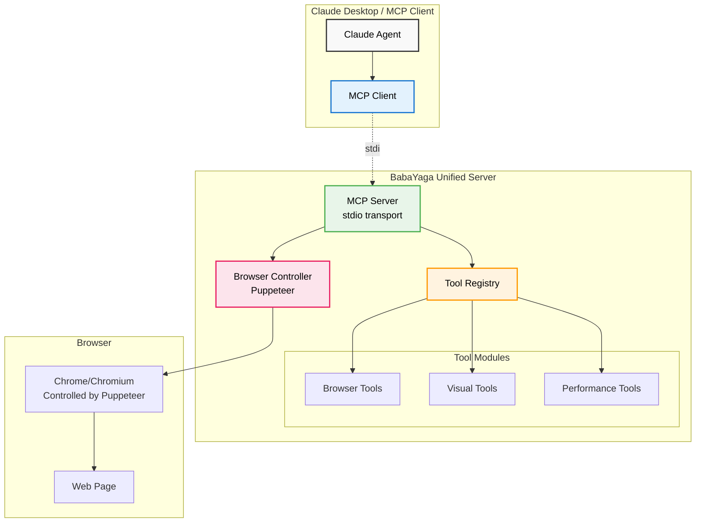

# BabaYaga Architecture Overview

## Unified Architecture

## Key Components

### 1. MCP Client (Claude Desktop)
- Connects to BabaYaga via stdio
- Sends tool requests
- Receives responses

### 2. BabaYaga Unified Server
- **Single Process**: Everything runs in one Node.js process
- **MCP Server**: Handles protocol communication
- **Tool Registry**: Manages available tools
- **Browser Controller**: Direct Puppeteer integration

### 3. Tool Modules
- **Browser Tools**: Navigation, clicking, typing, etc.
- **Visual Tools**: Screenshots with smart MCP token handling
- **Performance Tools**: Metrics and monitoring (planned)

### 4. Browser
- Controlled directly by Puppeteer
- No separate Chrome DevTools Protocol proxy
- Efficient, direct communication

## Data Flow

1. Claude sends a tool request via MCP
2. MCP Server receives and validates the request
3. Tool Registry finds the appropriate tool
4. Tool executes using Puppeteer
5. Response is formatted and sent back to Claude

## Benefits of Unified Architecture

- **Simplicity**: No IPC or subprocess management
- **Performance**: Direct control without proxy layers
- **Reliability**: Single process means fewer failure points
- **Debugging**: Standard Node.js debugging tools work
- **Type Safety**: Full TypeScript throughout