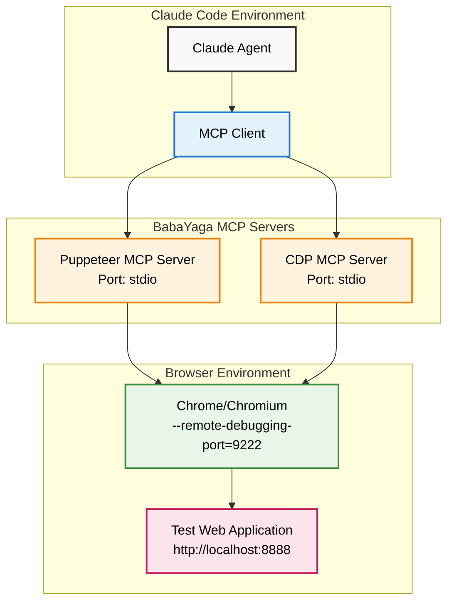

# BabaYaga Architecture Overview

## System Architecture



## Data Flow

### 1. Agent Request Flow
```
Claude Agent → Claude Code → MCP Server → Chrome → Web App
```

### 2. Tool Execution Flow

#### Puppeteer Tools:
- `navigate` → Browser Navigation
- `click` → Element Interaction
- `screenshot` → Visual Capture
- `evaluate` → JS Execution

#### CDP Tools:
- `cdp_connect` → DevTools Connection
- `cdp_evaluate` → Direct JS Execution
- `cdp_get_console_messages` → Console Monitoring
- `cdp_get_computed_style` → Style Inspection

## Component Responsibilities

### Puppeteer MCP Server
- **Purpose**: High-level browser automation
- **Strengths**: User interactions, navigation, screenshots
- **Protocol**: stdio (standard input/output)
- **Implementation**: Wraps puppeteer-mcp-server npm package

### CDP MCP Server
- **Purpose**: Low-level browser inspection
- **Strengths**: Console access, DOM manipulation, debugging
- **Protocol**: stdio with Chrome DevTools Protocol
- **Implementation**: Custom implementation using chrome-remote-interface

### Test Application
- **Purpose**: Controlled testing environment
- **Features**: 
  - Interactive buttons with console logging
  - Style manipulation controls
  - Form input processing
  - Real-time console output display

## Communication Protocols

### MCP Communication
```json
{
  "jsonrpc": "2.0",
  "method": "tools/call",
  "params": {
    "name": "tool_name",
    "arguments": {
      "param1": "value1"
    }
  }
}
```

### CDP Communication
```javascript
// Example CDP command
{
  method: "Runtime.evaluate",
  params: {
    expression: "document.title",
    returnByValue: true
  }
}
```

## Security Considerations

1. **Chrome Debugging Port**: Exposed on localhost only
2. **User Data Isolation**: Separate Chrome profile recommended
3. **MCP Server Access**: Limited to Claude Code environment
4. **No Remote Access**: All servers bind to localhost

## Performance Considerations

1. **Connection Pooling**: Single CDP connection per session
2. **Message Size**: CDP responses can be large (DOM trees)
3. **Resource Usage**: Chrome instances consume memory
4. **Concurrent Operations**: Both servers can run simultaneously

## Error Handling

1. **Connection Failures**: Graceful fallback with clear error messages
2. **Tool Timeouts**: Configurable timeouts for long operations
3. **Chrome Crashes**: Server detects and reports disconnections
4. **Invalid Selectors**: Validation before execution